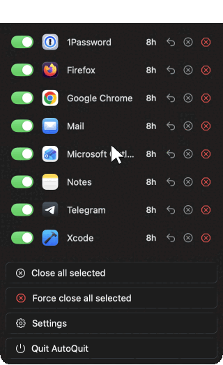
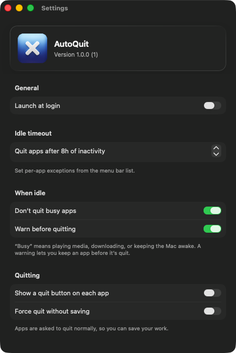

<div align="center">


# AutoQuit

**Automatically quit the apps you leave running.**

A small macOS menu bar app for people who end the day with Xcode, Photoshop, and a dozen other apps still open, it closes the ones you've stopped using, on its own.

   [](LICENSE)

<br>



</div>

You shut the lid at night and open it the next morning to find yesterday's heavy apps still running, still burning memory and battery for nothing. AutoQuit sits in the menu bar, counts each app down, and closes the idle ones for you — while leaving your background helpers and system apps alone.

## Features

- **Quits idle apps automatically** after a configurable timeout (8 hours by default).
- **Per-app control** — exclude an app entirely, or give it its own limit (1–48 hours).
- **Live countdown** for every app, with a one-click timer reset.
- **Close on demand** — quit every app you're tracking right now (gracefully, or forced without saving) instead of waiting out the countdown.
- **A heads-up before anything closes** — a notification with *Keep* and *Quit now*, and a 60-second grace period.
- **Leaves busy apps alone** — anything playing media, downloading, or keeping the Mac awake is skipped.
- **Launch at login**, menu-bar only (no Dock icon, no extra windows).
- **No dependencies, no network, no telemetry** — your settings stay on your Mac.

## Requirements

macOS 13.0 (Ventura) or later. Building from source also needs Xcode.

## Install

**Homebrew** (recommended):

```bash
brew install --cask rm335/tap/autoquit
```

_On Homebrew's strict tap-trust mode? Run `brew trust --tap rm335/tap` first._

**Direct download:** grab `AutoQuit-1.0.0.zip` from the [latest release](https://github.com/rm335/AutoQuit/releases/latest), unzip it, and move `AutoQuit.app` into `/Applications`.

> [!IMPORTANT]
> AutoQuit isn't signed or notarized yet, so macOS Gatekeeper blocks it on first launch — this applies to both the Homebrew and direct-download installs. To open it the first time, either clear the quarantine flag:
> ```bash
> xattr -dr com.apple.quarantine /Applications/AutoQuit.app
> ```
> or right-click `AutoQuit.app` in Finder and choose **Open**. You only need to do this once.

## Build from source

Clone the repository, then either open it in Xcode or build from the command line.

**In Xcode** — open `AutoQuit.xcodeproj`, select the `AutoQuit` scheme, and press Run. `DEVELOPMENT_TEAM` is left blank on purpose, so Xcode signs with your own account automatically — there's no team to set up.

**From the command line:**

```bash
xcodebuild -project AutoQuit.xcodeproj -scheme AutoQuit -configuration Debug \
  build CODE_SIGNING_ALLOWED=NO
```

`CODE_SIGNING_ALLOWED=NO` lets you build without a signing identity; drop it once you've configured your own team.

## Usage

AutoQuit lives in the menu bar. Click its icon to open the popover.

**Let it run.** Every app you open appears with a live countdown until it's quit — eight hours after you last used it, by default. The countdown turns orange under an hour and red under five minutes, so nothing disappears as a surprise.

**Keep an app running.** Flip an app's switch off and AutoQuit leaves it alone; its row reads *Excluded*.

> [!TIP]
> Want a different limit instead of off entirely? Click an app's countdown pill and pick one (1–48 hours) just for that app. The reset arrow restarts its timer on the spot.

**Close them now.** Don't want to wait for the countdown? **Close all selected** quits every app that's switched on, and **Force close all selected** does the same without stopping to save. Apps you've switched off are left alone, and both buttons dim when nothing is switched on.

**Change the defaults.** Open **Settings** from the popover to set the global idle timeout, turn on launch at login, and choose how idle apps are handled.

<p align="center">

</p>

## What it doesn't do

- **It only manages regular apps.** Menu bar utilities, background helpers, and Apple's system apps (Finder, Dock, Spotlight, Siri…) are never touched.
- **"Idle" means "not the app you're using."** AutoQuit tracks when each app was last in front. An app working silently in the background can look idle — unless it's playing media, downloading, or keeping the Mac awake, which AutoQuit detects and skips.
- **Per-app limits come from a fixed list** (1, 2, 4, 8, 12, 24, 48 hours), not a free-form value.
- **Nothing leaves your Mac.** Settings are stored locally; there's no account, sync, network access, or telemetry.

## How it works

Almost all of the code lives in `ContentView.swift`. A single `RunningAppsManager` remembers when each app last lost focus, checks the list about once a second (more often only while the popover is open, to save battery), and quits anything past its limit. The interface is built with String Catalogs and includes a Dutch translation. See [`ARCHITECTURE.md`](ARCHITECTURE.md) for the full picture.

The quit decision and the countdown formatting are unit-tested:

```bash
xcodebuild test -project AutoQuit.xcodeproj -scheme AutoQuit \
  -destination 'platform=macOS' -only-testing:AutoQuitTests CODE_SIGNING_ALLOWED=NO
```

---

<sub>AutoQuit is free software under the [GNU General Public License v3.0](LICENSE). Copyright © 2023–2026 Rob Mulder.</sub>
